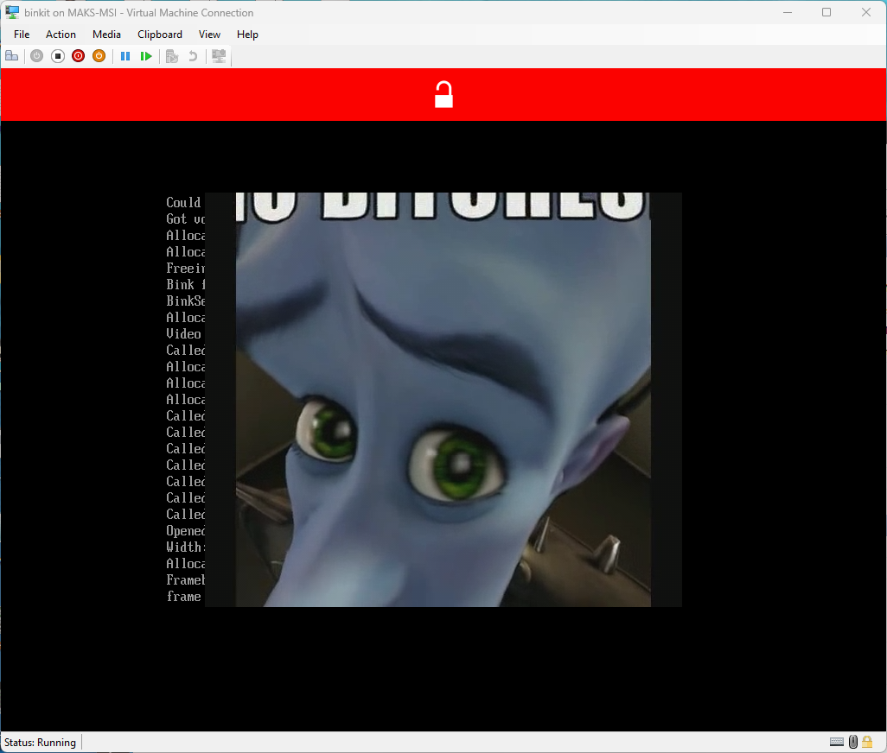

# bink video 2 running under uefi

pretty cool right?

<table>
  <tr>
    <td align="center"></td>
    <td align="center"></td>
  </tr>
  <tr>
    <td align="center"></td>
    <td align="center"></td>
  </tr>
  <tr>
    <td colspan="2" align="center"></td>
  </tr>
</table>

## what is it?

a simple bink player.. running under uefi!

## how?

from the outside it looks like wine but less running under uefi instead of linux.

## legal?

nobody noticed my project yet.

## how 2 build

open x64 vs dev prompt
- `build.bat`
- `run.bat`
- enjoy

the video to play is fatroot/idk.bk2 (for now for testing, before it was video.bk2 and earlies video.bik)

## q&a

Q: Why does it exist?  
A: Cool idea + time = explosive mix.

Q: Is this finished?  
A: Some parts yes.

Q: Will you add audio?  
A: soon™
