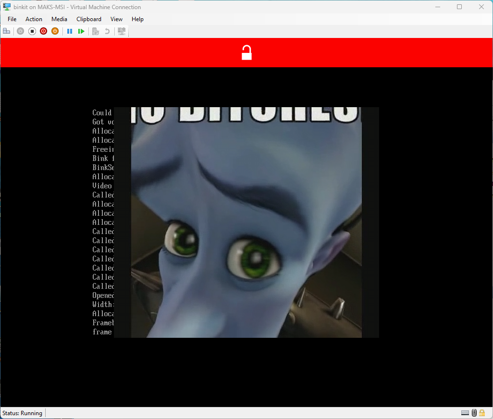

# bink video 2 running under uefi

pretty cool right?

<table>
  <tr>
    <td align="center"></td>
    <td align="center"></td>
  </tr>
  <tr>
    <td align="center"></td>
    <td align="center"></td>
  </tr>
  <tr>
    <td colspan="2" align="center"></td>
  </tr>
</table>

## what is it?

a ~~microkernel in denial~~ simple bink player.. running under uefi!

## how?

from the outside it looks like wine but less running under uefi instead of linux.  
i respect the firmware, but i also make it dance.

i shim a subset of win32 calls up to vista (nt 6) and load the proprietary blob (dll).

## legal?

nobody noticed this yet.  
either a job offer or a C&D 🙏 (rad don't kill me)

## how 2 build

open x64 vs dev prompt
- `build.bat`
- `run.bat`
- enjoy

the video to play is fatroot/video.bk2

## q&a

Q: Why does it exist?  
A: Science isn't about 'why', it's about 'why not'.

Q: Why not raw frames?  
A: Too simple.

Q: How did you implement file I/O?
A: I didn't. I just preload the entire video into memory.

Q: Is this finished?  
A: Mostly.

Q: Can I use this in production?  
A: Define production.

Q: Will you add audio?  
A: soon™

Q: When?  
A: When it's ready.
